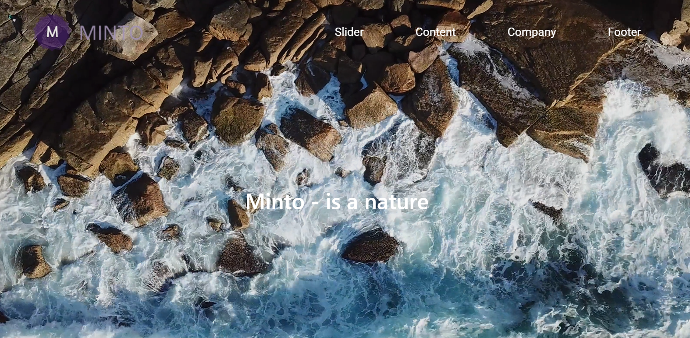

# Третий проект Web_site_js_test

Ссылка на проект: https://utkamag.github.io/Web_site_js_test/

Технологии, используемые в работе: HTML/CSS/JavaScript

Сайт адаптирован для всех популярных платформ.

JavaScript:

1) anchors.js - Скрипт для плавной прокрутки к якорным ссылкам
2) header.js - Скрипт для скрытия элемента ".header"
3) preloader.js - Прелоадер для сайта 
